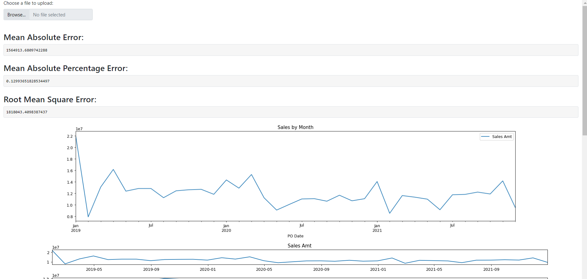

# Hire Digital Data Developer Demo
This repo is used to demonstrate a simple holt winters seasonal forecasting model on a sample time series data to Hire Digital Team

## Data Developer Assessment
### Scope
  This assessment will test your ability to build an application using data and statistical modeling in R or Python with Shiny.

### Brief
- For this assessment, we have included a file titled `Data.xslx` which is a dataset that contains time series data with product sales information.

- The goal of this exercise is to take a dataset that contains time series data and generate a 24-month sales forecasting application using Shiny.

- Your requirements for this assessments are:

    1.  Create a plot of the dataset in Shiny and deploy it to a test server.
    2.  Overlay a Holt-Winters Seasonal forecasting model with the data and extrapolate it for 24-months.
    3.	Calculate and display performance metrics of the model so the user knows how accurate the model is. You can decide what metrics to show.
    4.	Create a function to allow the user to upload a new dataset to replace the current one and update the forecast.
    5.	Bonus: Add additional forecasting models and allow the user to select a different model to see if it's more effective.

### Deliverables
- You will need to deploy the application to the web (https://www.shinyapps.io/) and provide us with the link to review.

- In addition, post your code to a private Github repository and provide the user hd-assessments-review with read-only access to the code.

- Do not commit the dataset in the repository, and ensure that your repository is private.

- You will need to present the application and explain its functionality to a Hire Digital Technical Recruiter.

# **NOTE**
- Only one file is allowed to upload at a time.Multiple files not allowed
- Only files with `*.xlsx` extension are allowed
- Web app takes about *5-15 secs* on an average depending on responsiveness of `shinyapps.io` server for the results to appear on the screen
- A successful run will look as shown below
  
- On opening web app, by default you are presented with results based on the `data.xlsx` provided
- A sample demo on usage of the webapp can be seen at `./demo_video.mp4` video file
- Netiher this code nor webapp is production grade and is purely for demonstration purposes only
- Code does have multiple anti patterns and doesn't conform to any development standards
-
### For any queries relating to any content in this repo, please reach out to: kmr0877@gmail.com